# Car Value

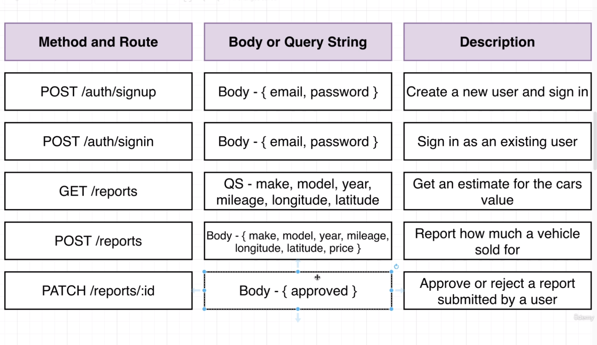

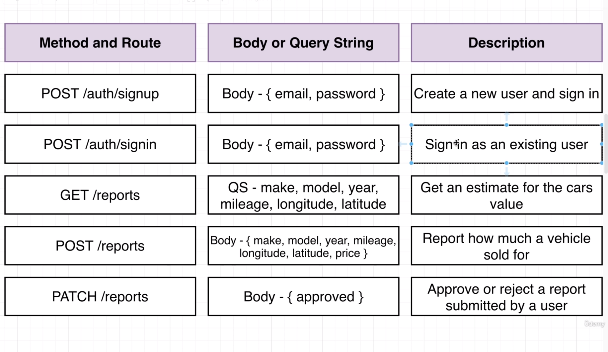

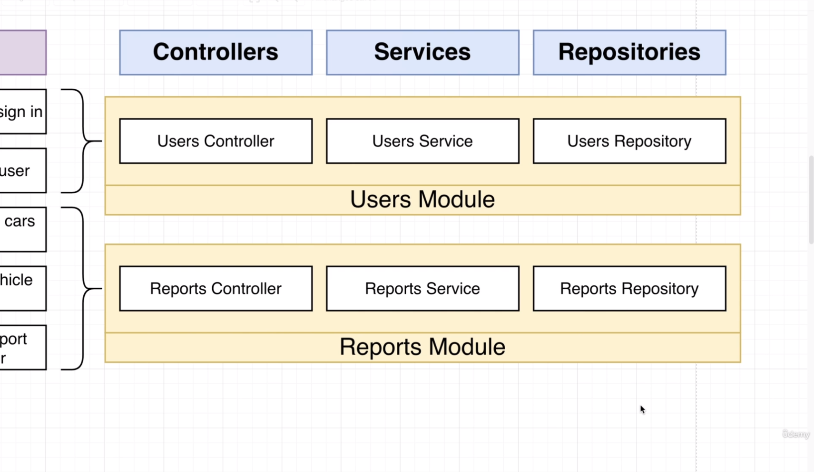

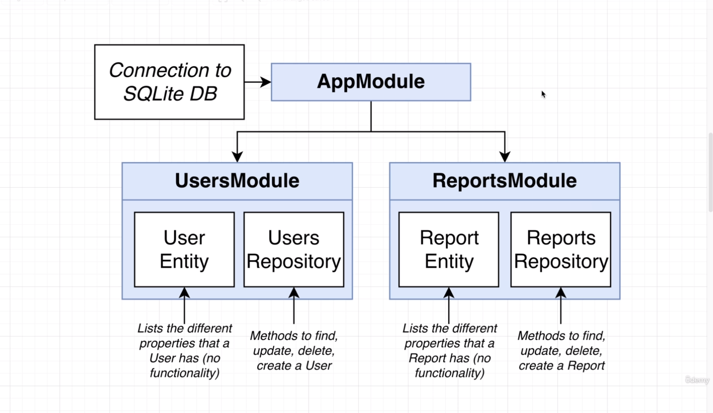

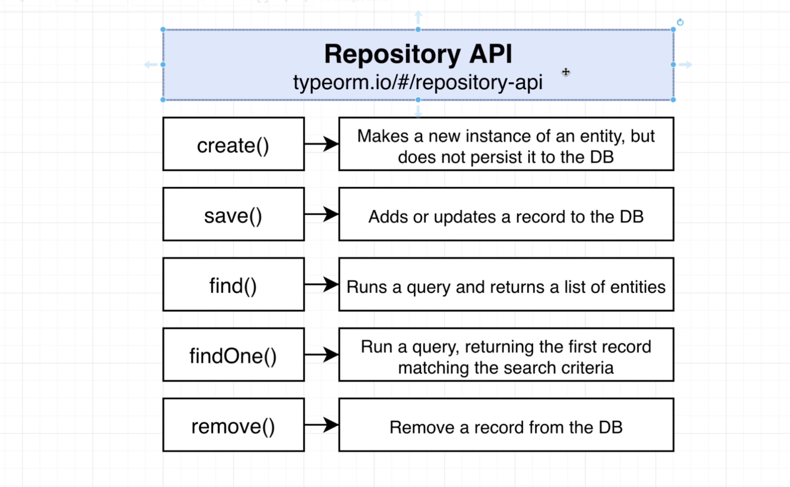

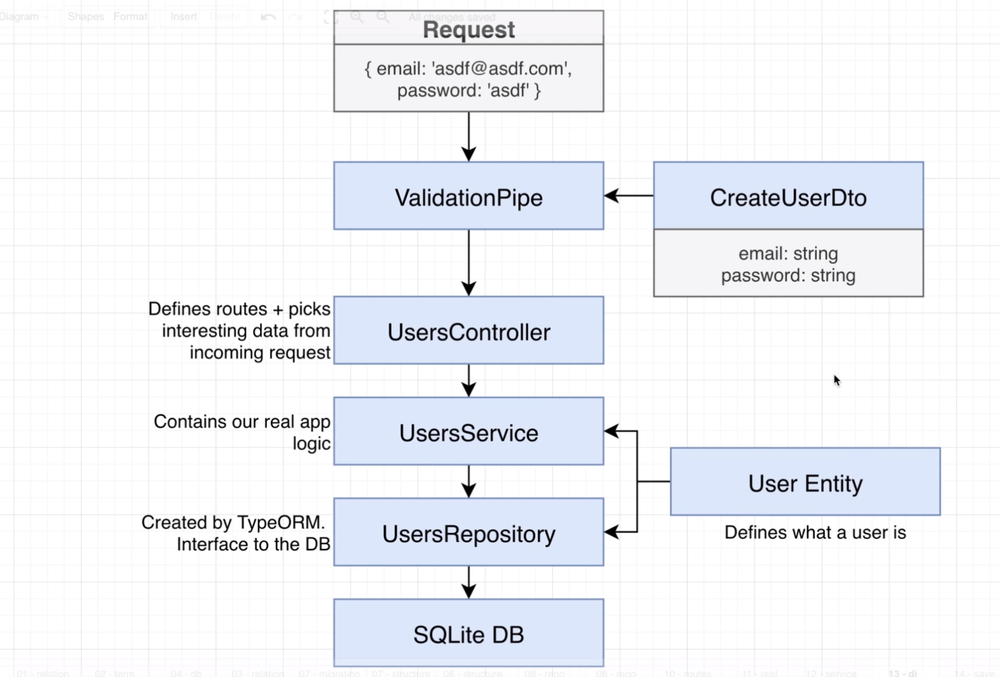

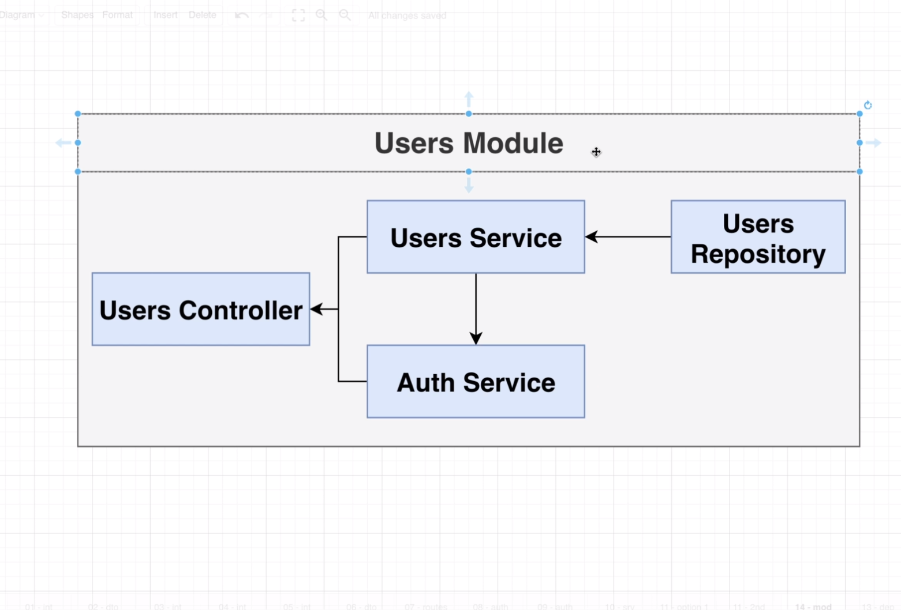

# Relationships

## One To One

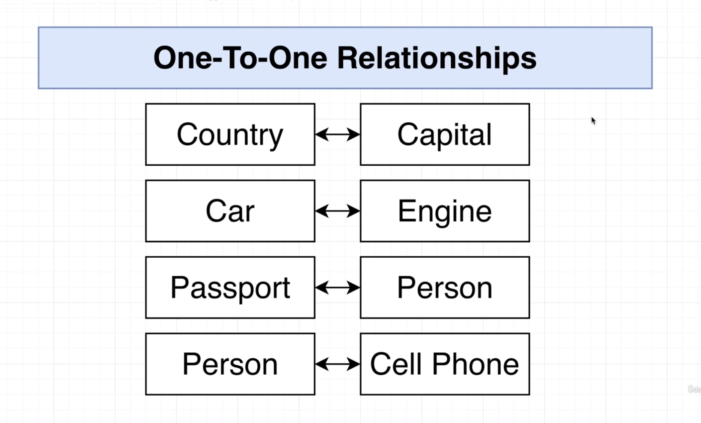

## One To Many <> Many To One

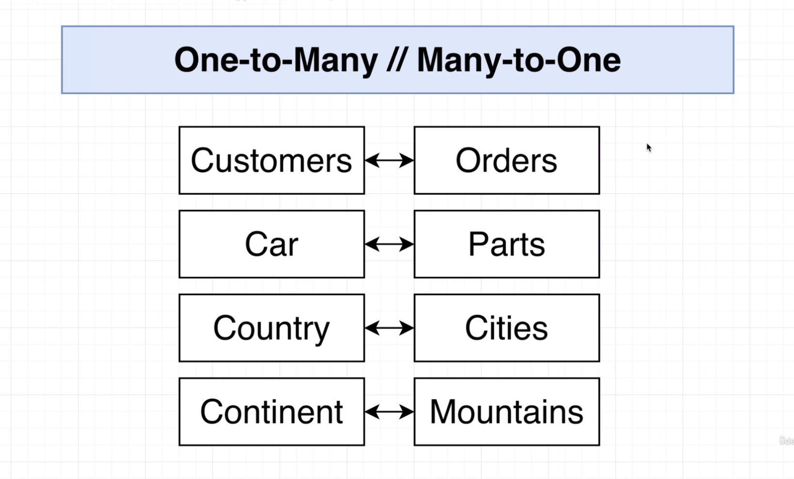

## Many To Many

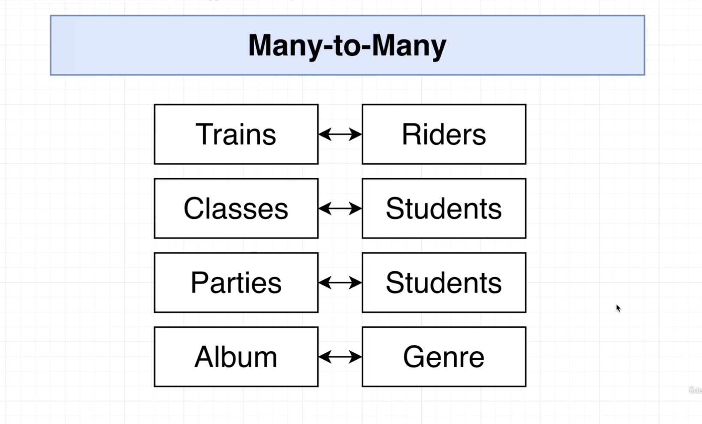

## User Relationship

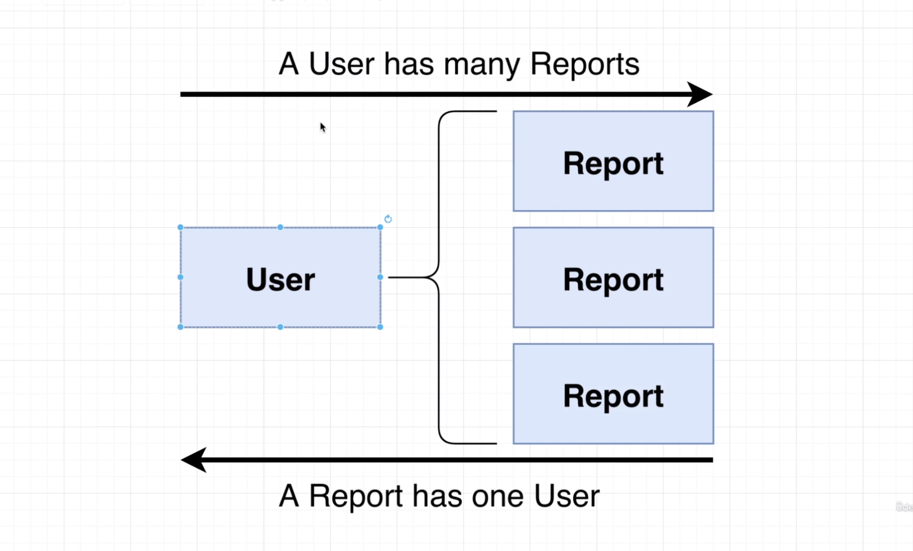
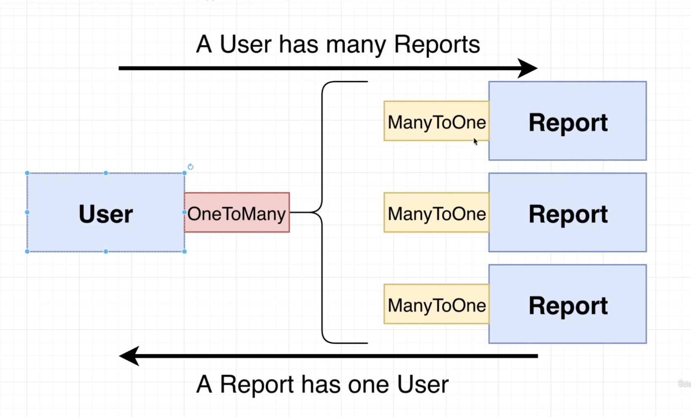

```bash
nest generate module users
nest generate module reports

nest generate controller users
nest generate controller reports

nest generate service users
nest generate service reports
```

```bash
npm install --save @nestjs/typeorm typeorm sqlite3
```
