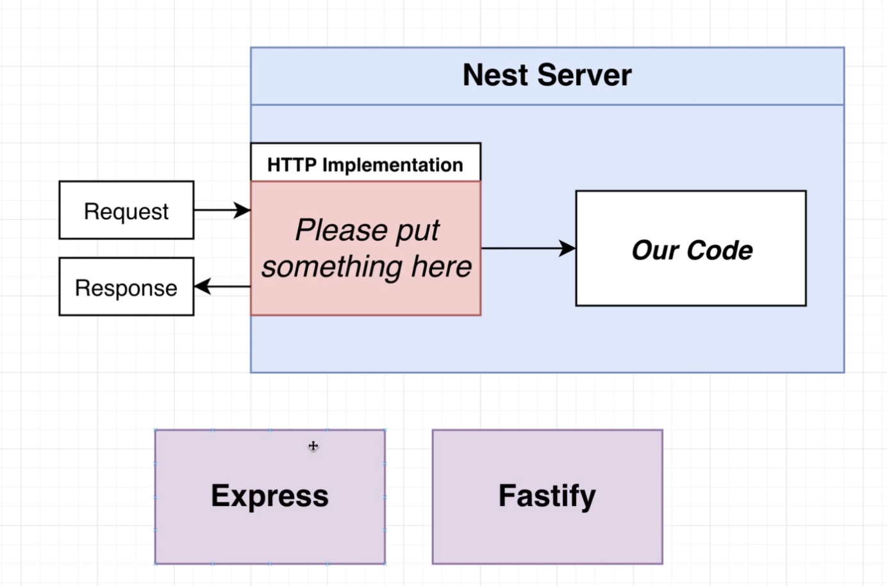
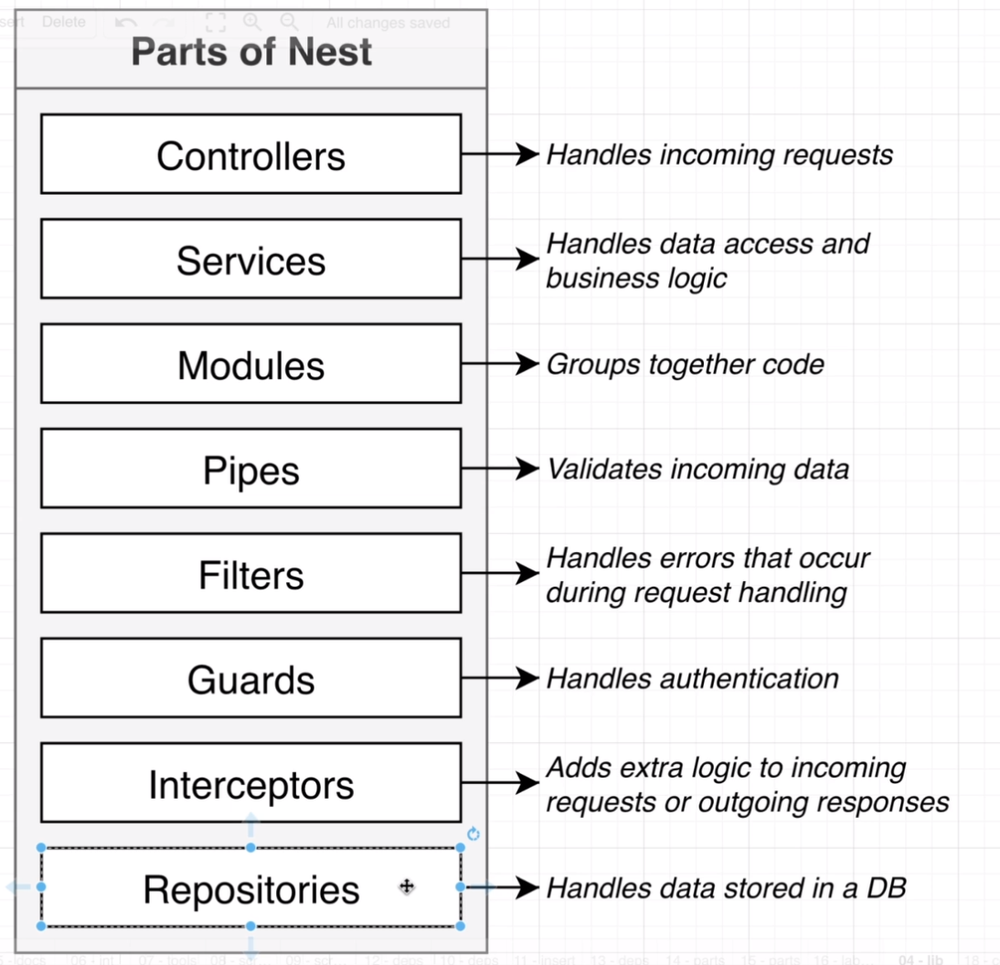
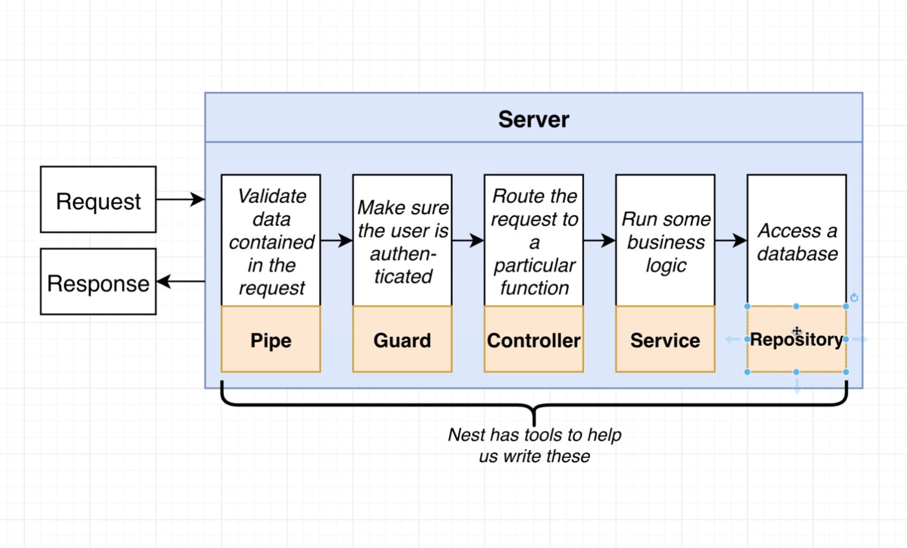
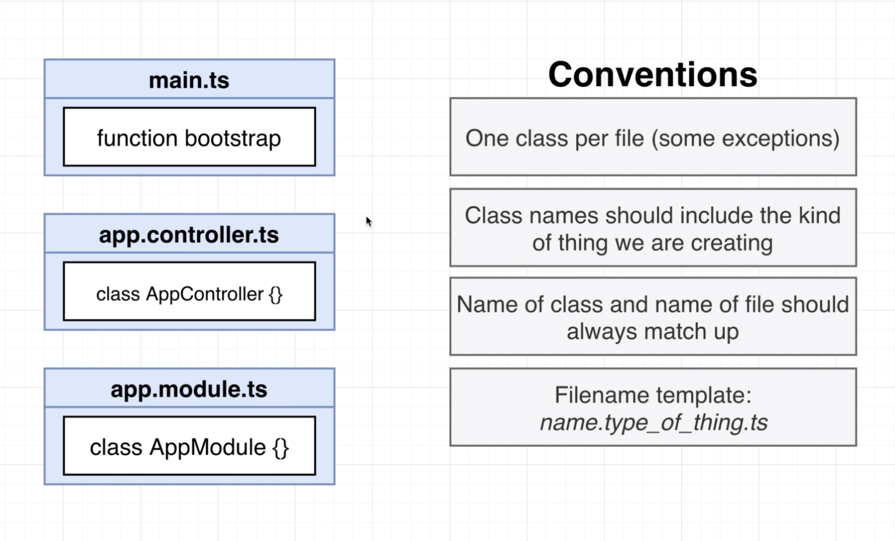
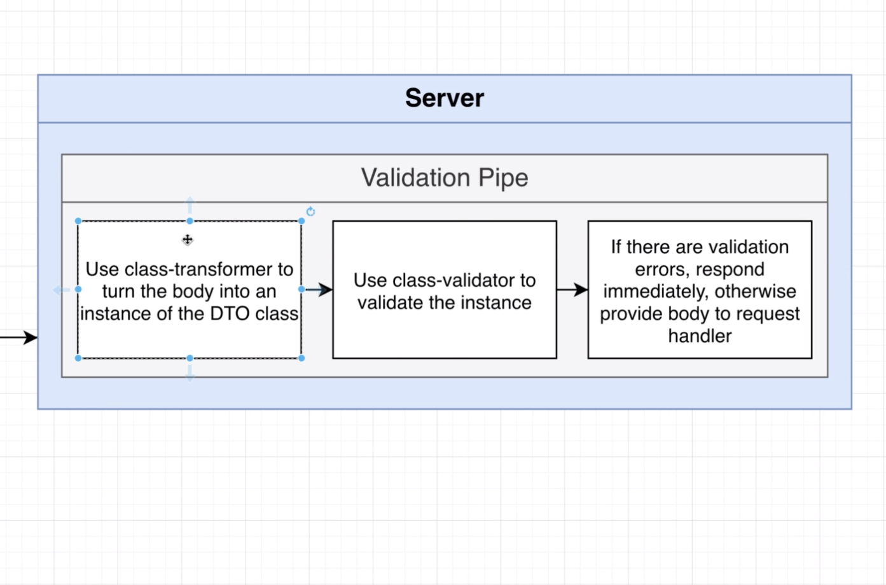
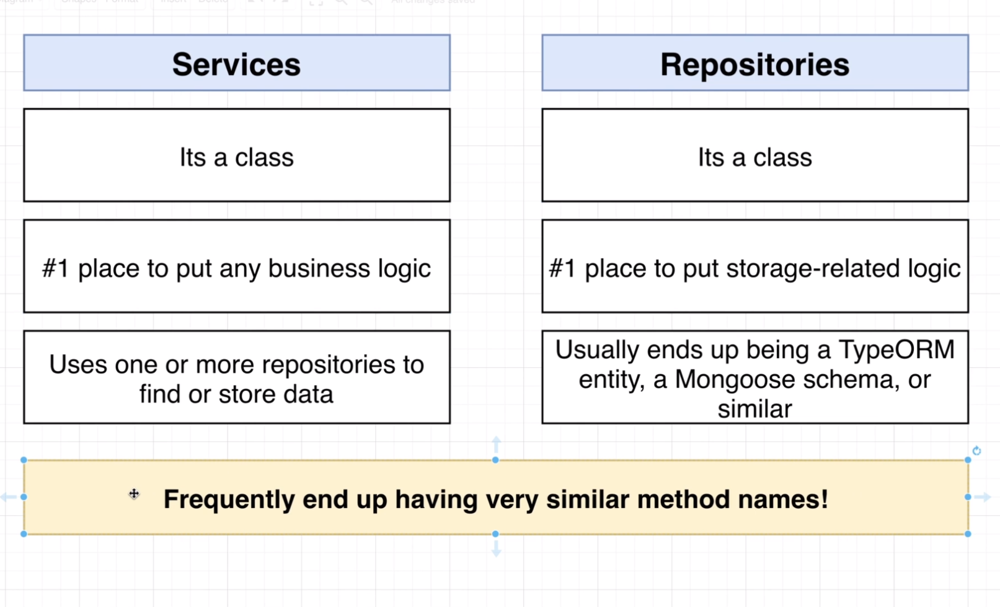
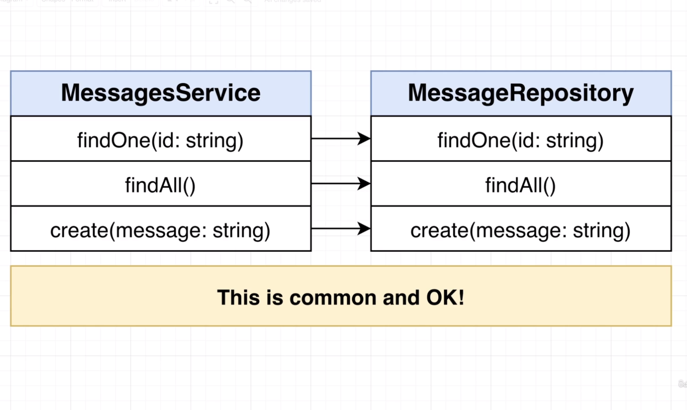
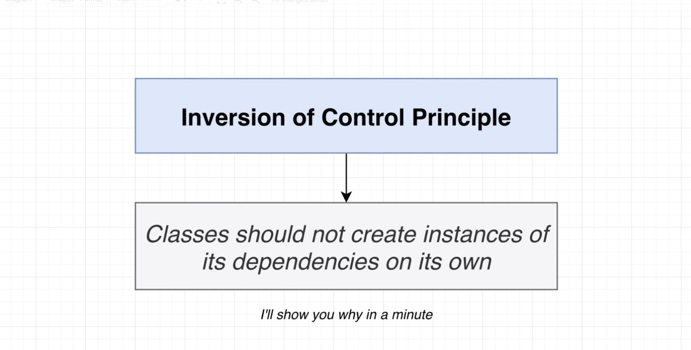

# Http Server Implementation



# Parts Of Nest



# Server



# File Naming Conventions



# Validation Pipe



# Services and Repositories




# Inversion of Control Principle



# CMDs

```bash
nest new messages
nest generate module messages
nest generate controller messages/messages --flat
```

# DI

```bash
nest generate module computer
nest generate module cpu
nest generate module disk
nest generate module power

nest generate service cpu
nest generate service disk
nest generate service power

nest generate controller computer
```
